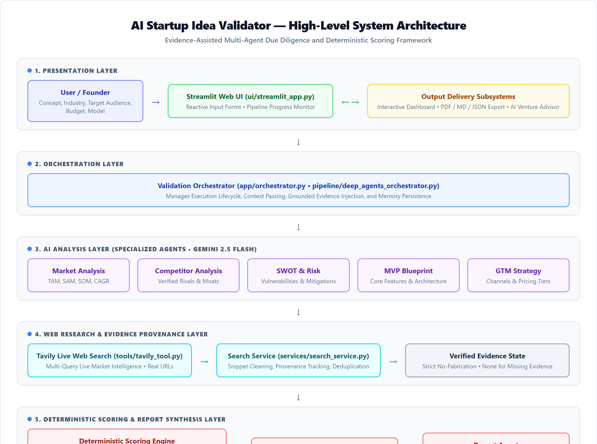
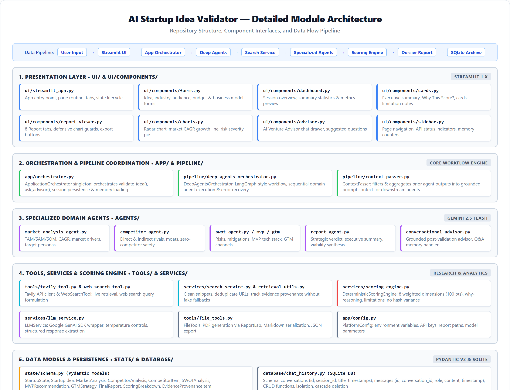

# AI Startup Idea Validator with Market Analysis Assistance

Autonomous, evidence-grounded multi-agent due diligence and venture feasibility platform built with **Python**, **Streamlit**, **LangGraph / Deep Agents**, **Google Gemini**, **Tavily Search**, **SQLite**, and an **8-Dimension Deterministic Scoring Engine**.

---

## 1. Project Overview

The **AI Startup Idea Validator with Market Analysis Assistance** is a production-grade validation platform that evaluates early-stage startup concepts before founders commit capital and engineering resources. Combining real-time web research, LLM-based strategic synthesis, and reproducible mathematical scoring rubrics, the platform generates comprehensive investment-grade validation dossiers and provides an interactive, session-isolated conversational venture advisor.

---

## 2. Problem Statement

Early-stage entrepreneurs face critical challenges when evaluating business viability:
- **Manual Research Overhead**: Conducting TAM/SAM/SOM sizing, competitive landscape mapping, and SWOT analysis manually requires 40+ hours per idea.
- **Subjective / Biased Evaluation**: Traditional assessments often rely on founder intuition, uncalibrated pitch deck feedback, or non-deterministic LLM score hallucinations.
- **Unverified Hallucinations**: Generic AI chatbots frequently hallucinate market statistics, fabricate competitor names, and invent unrealistic growth projections.
- **Absence of Unified Due Diligence**: Existing tools offer disconnected point solutions (isolated chatbots or basic business plan generators) rather than an integrated, end-to-end analytical workflow.

---

## 3. Objectives

- **Automate Full-Funnel Due Diligence**: Execute automated market sizing, incumbent benchmarking, risk matrix formulation, MVP scoping, and go-to-market planning in under 60 seconds.
- **Guarantee Evidence Grounding**: Ground all market sizing, competitors, and industry trends strictly in verified Tavily web search results with verifiable citation provenance.
- **Deliver Deterministic Scoring**: Eliminate AI scoring randomness using a mathematical 8-dimension weighted rubric (0–100 total) with explicit evidence limitation tracking ("Why This Score").
- **Provide Session-Isolated Interactive Advisory**: Enable founders to interrogate their validation results via an interactive chat advisor backed by thread-isolated SQLite persistence.
- **Ensure Sustainable Free-Tier Operation**: Minimize LLM token consumption and API request overhead through deterministic planning, pre-search evidence caching, and direct single-pass synthesis (`gemini-3.1-flash-lite`).

---

## 4. Key Features

- **Strategic Planning**: Deterministic research objective and hypothesis formulation prior to validation.
- **Live Tavily Web Research**: Targeted multi-category search across market trends, competitors, customer pain points, industry news, and funding intelligence.
- **Evidence-Grounded Synthesis**: Single-pass Deep Agent synthesis strictly bound to retrieved search evidence.
- **Deterministic 8-Dimension Scoring Engine**: Mathematically calculates 0–100 overall viability score with zero seed or hash variance.
- **"Why This Score" Deductions & Explainability**: Transparent diagnostic breakdowns linking evidence gaps directly to score adjustments.
- **Multi-Format Export**: One-click generation of executive dossiers in PDF (ReportLab), Markdown, and JSON formats.
- **Conversational Venture Advisor**: Interactive dialogue assistant grounded in validation report facts with autonomous live web search for external queries.
- **SQLite Session & Chat Isolation**: Thread-safe database persistence ensuring complete conversation boundary isolation per validation session.
- **Predictable Free-Tier Architecture**: Zero-retry policy (`max_retries=0`), subagent recursion ceiling (`recursion_limit=10`), and eliminated redundant agent searches.

---

## 5. Technology Stack

| Layer | Technology | Purpose |
|---|---|---|
| **Frontend UI** | Streamlit, Modern Vanilla CSS | Responsive founder dashboard, metric cards, tabbed dossiers, advisor drawer |
| **Data Visualizations** | Plotly | Viability gauge, 8-dimension bar matrix, strategic radar profile, 5-year CAGR growth projection |
| **Agent Orchestration** | LangGraph, Deep Agents (`deepagents`) | Autonomous multi-agent pipeline and subagent task structuring |
| **Reasoning LLM** | Google Gemini (`gemini-3.1-flash-lite`) | Single-pass domain synthesis and contextual conversational advisory |
| **Live Web Research** | Tavily Search API (`tavily-python`) | Real-time market signals, competitor URLs, snippets, and industry intelligence |
| **Data Models** | Pydantic V2 | Strict type validation, inter-agent data contracts, and schema serialization |
| **Local Persistence** | SQLite3 (`database/chat_history.db`) | Foreign-key constrained, session-isolated conversation threads and messages |
| **Dossier Cache** | File-backed JSON (`.validation_memory/`) | Session-isolated state recovery and advisor dossier loading |
| **Document Export** | ReportLab, Python-Markdown | High-resolution PDF generation and clean Markdown/JSON exports |
| **Test Suite** | Pytest | 177 automated unit and integration tests |

---

## 6. System Workflow

The end-to-end validation pipeline executes sequentially across 18 coordinated stages:

```
[1. Founder Idea Input]
          │
[2. Deterministic Planning]
          │
[3. Live Tavily Web Research]
          │
[4. Evidence Collection & Provenance Logging]
          │
[5. Evidence Injection into Gemini Context]
          │
[6. Direct Single-Pass Gemini Synthesis]
          │
[7. Structured & Markdown Parsing]
          │
[8. Market Sizing (TAM/SAM/SOM/CAGR)]
          │
[9. Competitor Analysis & Moat Assessment]
          │
[10. SWOT & Categorized Risk Register]
          │
[11. 4-Week MVP Roadmap & Tech Stack]
          │
[12. Go-To-Market (GTM) Strategy & Pricing]
          │
[13. Deterministic 8-Dimension Scoring Engine]
          │
[14. "Why This Score" Diagnostic Breakdown]
          │
[15. Comprehensive Validation Dossier Generation]
          │
[16. PDF / Markdown / JSON Exporters]
          │
[17. Conversational Venture Advisor]
          │
[18. SQLite Session-Isolated Chat History]
```

---

## 7. High-Level Architecture (HLA)

The high-level architecture separates the application into clean, decoupled tiers: Presentation, Application Orchestration, Multi-Agent Intelligence, Deterministic Evaluation, and Session Persistence.



### Architectural Layers
1. **Presentation Layer**: Streamlit web interface with interactive inputs, tabbed report visualizers, Plotly dashboards, and slide-out advisor chat.
2. **Orchestration Layer (`app/orchestrator.py`)**: Coordinates pipeline execution, memory persistence, file exports, and advisor delegation.
3. **Intelligence Pipeline (`pipeline/deep_agents_orchestrator.py`)**: Executes deterministic planning, Tavily intelligence retrieval, and single-pass Deep Agent synthesis.
4. **Scoring Engine (`services/scoring_engine.py`)**: Computes objective viability, investor readiness, and evidence limitation deductions.
5. **Storage Layer**: SQLite (`database/chat_history.db`) for multi-turn conversations and local state cache for report dossiers.

---

## 8. Low-Level Architecture (LLA)

The low-level execution pipeline guarantees deterministic flow and zero redundant API requests:



- **Detailed Pipeline Flow Diagram**: Refer to [docs/diagrams/pipeline_flow.mmd](docs/diagrams/pipeline_flow.mmd) for node-level transitions.
- **Strict Data Contracts**: All inter-stage exchanges adhere to Pydantic schemas in `state/schema.py` (`StartupIdea`, `WebSearchResults`, `MarketAnalysis`, `CompetitorAnalysis`, `SWOTAnalysis`, `MVPRecommendation`, `GTMStrategy`, `ScoringBreakdown`, `ValidationReport`, `StartupState`).

---

## 9. Component & Agent Roles

| Component / Agent | Implementation File | Key Responsibilities |
|---|---|---|
| **Strategic Planner** | `tools/planning_tool.py` (`DeepAgentsPlanner`) | Decomposes startup concept into structured research objectives (deterministic mode, 0 LLM calls). |
| **Tavily Research Tool** | `tools/tavily_tool.py` (`TavilySearchTool`) | Executes categorized live queries across market trends, competitors, pain points, news, and funding. |
| **Deep Agents Orchestrator** | `pipeline/deep_agents_orchestrator.py` | Compiles Deep Agent graph with subagents and orchestrates single-pass synthesis with output contract enforcement. |
| **Market Analysis** | Inline Subagent / Parser | Extracts TAM, SAM, SOM, projected CAGR %, sector growth drivers, and ICP buyer personas. |
| **Competitor Analysis** | Inline Subagent / Parser | Identifies direct/indirect competitors, feature matrices, pricing tiers, and defensibility moats. |
| **SWOT & Risk Assessment** | Inline Subagent / Parser | Formulates 4-quadrant SWOT and evaluates quantified risk registers (financial, technical, regulatory). |
| **MVP Recommendation** | Inline Subagent / Parser | Scopes core value proposition, Must-Have vs. Should-Have features, 4-week execution roadmap, and tech stack. |
| **GTM Strategy** | Inline Subagent / Parser | Outlines primary acquisition channels, positioning statements, launch tactics, and estimated CAC. |
| **Report Synthesis** | Inline Subagent / Parser | Generates executive summary, key takeaways, strategic verdict, and recommended next steps. |
| **Scoring Engine** | `services/scoring_engine.py` | Executes 8-dimension weighted calculation and generates transparent evidence deductions. |
| **Venture Advisor** | `agents/conversational_advisor.py` | Context-grounded Q&A assistant with intent classification and autonomous Tavily search fallback. |
| **Chat Persistence** | `database/chat_history.py` | Manages SQLite conversations and message history strictly scoped by `session_id`. |

---

## 10. Evidence Provenance & Grounding Rules

To ensure academic and institutional credibility, the platform enforces strict grounding policies:
- **No Fabricated Data**: If Tavily search yields no quantifiable data for TAM, SAM, SOM, or CAGR, the fields remain `None` and are labeled `"Evidence unavailable"`. The system never invents market sizing numbers.
- **No Fabricated Competitors or URLs**: Competitors are extracted solely from verified research snippets. Generic placeholder domains (`example.com`, `tavily.com`) are strictly excluded.
- **Unsubstantiated Pricing Prevention**: Competitor `pricing_model` defaults to `""`. When pricing is not discovered in research, no assumption (e.g. "Freemium") is applied.
- **Citation Provenance**: Every retrieved search result retains its source title, exact URL, snippet, query category, and ISO UTC retrieval timestamp for verification.

---

## 11. Deterministic 8-Dimension Scoring

Startup viability is evaluated using an objective 100-point rubric across 8 weighted dimensions:

| Dimension | Max Points | Weight | Primary Calculation Drivers |
|---|:---:|:---:|---|
| **Market Opportunity** | 20 | 20% | TAM ($B), SAM ($B), SOM ($B), and projected sector CAGR % |
| **Innovation & Differentiation** | 15 | 15% | Novelty of value proposition, AI automation depth, and keyword defensibility |
| **Competition & Moat** | 15 | 15% | Incumbent market density, moat mechanisms (network effects, switching costs, IP) |
| **Scalability Potential** | 15 | 15% | Software gross margin profile, geographic expandability, recurring revenue mechanics |
| **Technical Feasibility** | 10 | 10% | Feasibility of 4-week MVP, architectural stack maturity, engineering complexity |
| **Revenue Model Viability** | 10 | 10% | Monetization structure (B2B SaaS, usage-based) and customer willingness to pay |
| **Execution & Risk Resilience** | 10 | 10% | Inverse financial, technical, and regulatory risk severities |
| **Market Timing** | 5 | 5% | Industry tailwinds, macro trends, and technological or regulatory catalysts |
| **Total Viability Index** | **100** | **100%** | **Sum of all 8 dimension scores** |

### Supplementary Decision Metrics
- **Investor Readiness Score** (0–100): Evaluates diligence maturity for angel/seed fundraising.
- **Funding Probability** (0–100%): Estimated probability of attracting institutional backing.
- **Product-Market Fit (PMF) Index** (0–100): Urgency of customer pain points vs. proposed solution.
- **Overall Confidence Score** (20–95%): Evidence completeness metric (capped at 65% when live web search is unavailable).

---

## 12. "Why This Score" Diagnostics & Verdict Thresholds

The scoring engine provides explicit diagnostic explanations detailing point deductions:
- Missing TAM/SAM/SOM or CAGR data applies unweighted baseline scoring with transparent limitation reporting.
- High regulatory or technical risks generate explicit point deduction notices.
- Missing competitor evidence applies an unweighted baseline score with a warning that competitive landscape is unverified.

### Strategic Verdict Classifications
| Verdict | Total Score | Strategic Recommendation |
|---|:---:|---|
| **PROCEED** | &ge; 78 | Strong market opportunity, manageable risks, clear differentiation, and viable 4-week MVP. Recommended for prototype development and customer validation. |
| **CAUTION** | 65 – 77 | Viable core concept with notable headwinds or unverified market/competitor evidence. Requires targeted de-risking and discovery interviews before capital expenditure. |
| **PIVOT** | 50 – 64 | Substantial execution, competitive, or structural friction identified. Refine target audience, differentiation, or business model before proceeding. |
| **STOP** | &lt; 50 | Critical structural barriers, minimal addressable demand, or entrenched incumbent dominance. Re-evaluate core premise. |

---

## 13. Conversational Advisor & SQLite Session Isolation

The embedded **AI Venture Advisor** allows founders to explore follow-up questions:
- **Report-First Grounding**: Answers are grounded primarily in the generated validation dossier.
- **Intent-Based Context Scoping**: Incoming questions are classified (`market`, `competition`, `risk`, `mvp`, `gtm`, `sources`, `funding`, `score`) to inject focused state context.
- **Autonomous Web Research Fallback**: External or recency questions (e.g. "What are latest 2026 competitor pricing updates?") trigger targeted supplementary Tavily searches.
- **SQLite Session Isolation**: All conversations (`conversations` table) and chat exchanges (`messages` table) require a non-empty `session_id`. Queries strictly enforce session ownership, preventing cross-session contamination.

---

## 14. Free-Tier Optimization

The platform is engineered for completely free, sustainable execution on free-tier API quotas:
1. **Deterministic Planning**: `DeepAgentsPlanner.plan_validation(use_llm=False)` eliminates 1 LLM request during planning.
2. **Orchestrator Pre-Search**: Tavily search is executed once upfront by the orchestrator.
3. **No Redundant Subagent Searches**: Production inline subagents have `tools: []`, preventing subagents from making duplicate Tavily requests.
4. **Single-Pass Synthesis**: The main Deep Agent directly synthesizes the validation report from injected evidence in a single pass.
5. **Zero-Retry Protection**: `ChatGoogleGenerativeAI(max_retries=0)` prevents cascading quota exhaustion during rate limits.
6. **Strict Recursion Ceiling**: `with_config({"recursion_limit": 10})` prevents runaway graph loops.
7. **Free-Tier Model**: Configured by default to `gemini-3.1-flash-lite`.

---

## 15. Installation & Setup

### Prerequisites
- Python 3.10, 3.11, 3.12, 3.13, or 3.14
- Google Gemini API Key ([Google AI Studio](https://aistudio.google.com/))
- Tavily Search API Key ([Tavily](https://tavily.com/))

### Clone Repository
```bash
git clone https://github.com/CHANDRASAI9491/AI-Startup-Idea-Validator.git
cd AI-Startup-Idea-Validator
```

### Create and Activate Virtual Environment
#### Windows (PowerShell):
```powershell
python -m venv .venv
.venv\Scripts\Activate.ps1
```

#### Linux / macOS:
```bash
python3 -m venv .venv
source .venv/bin/activate
```

### Install Dependencies
```bash
pip install -r requirements.txt
```

---

## 16. Environment Variables

Create a `.env` file in the project root based on `.env.example`:

```env
GOOGLE_API_KEY=your_gemini_api_key_here
TAVILY_API_KEY=your_tavily_api_key_here
MODEL_NAME=gemini-3.1-flash-lite
MAX_SEARCH_RESULTS=5
EXPORT_DIR=reports
```

| Variable | Required | Default | Description |
|---|:---:|---|---|
| `GOOGLE_API_KEY` | **Yes** | None | Google Gemini API key for LLM reasoning |
| `TAVILY_API_KEY` | **Yes** | None | Tavily Search API key for real-time web intelligence |
| `MODEL_NAME` | No | `gemini-3.1-flash-lite` | Gemini model identifier |
| `MAX_SEARCH_RESULTS` | No | `5` | Maximum search results retrieved per category |
| `EXPORT_DIR` | No | `reports` | Target directory for generated PDF/MD/JSON exports |

---

## 17. Running the Application

Launch the Streamlit SaaS application:

```bash
python -m streamlit run ui/streamlit_app.py
```

Access the interactive web dashboard at:
```
http://localhost:8501
```

### Command-Line Interface (CLI)
For automated headless validation runs:
```bash
python app/main.py --idea "AI-powered automated contract review for small law firms" --industry "LegalTech" --audience "Small Law Firms"
```

---

## 18. Testing & Verification

The test suite contains **177 comprehensive automated tests** validating scoring boundaries, evidence grounding, multi-agent synthesis, session isolation, and Free-Tier configurations.

### Run Full Test Suite
```bash
python -m pytest -q
```

### Verified Test Result
```
........................................................................ [ 40%]
........................................................................ [ 81%]
.................................                                        [100%]
177 passed, 1 warning in 956.89s
```
*(The single warning is a harmless, non-fatal upstream `_UnionGenericAlias` Python 3.14 deprecation notice in `google.genai`).*

### Run Focused Subsystem Tests
```bash
# Deterministic scoring engine tests
python -m pytest tests/test_scoring_engine.py -q

# Evidence grounding and search tests
python -m pytest tests/test_web_search.py -q

# Deep Agents integration and Free-Tier verification
python -m pytest tests/test_deep_agents_integration.py -q

# Conversational advisor and SQLite session isolation
python -m pytest tests/test_conversational_advisor.py tests/test_chat_history.py -q
```

---

## 19. Project Structure

```
AI-Startup-Idea-Validator/
│
├── agents/                       # Specialized agent implementations
│   ├── base_agent.py             # Abstract base agent with prompt loader & JSON parser
│   ├── competitor_agent.py       # Competitor intelligence & moat agent
│   ├── conversational_advisor.py # Grounded conversational venture advisor
│   ├── gtm_strategy_agent.py     # Go-To-Market & customer acquisition agent
│   ├── market_analysis_agent.py  # Market sizing & customer persona agent
│   ├── mvp_recommendation_agent.py # MVP architecture & roadmap agent
│   ├── report_agent.py           # Executive validation report synthesis agent
│   ├── swot_risk_agent.py        # SWOT & quantified risk evaluation agent
│   └── web_search_agent.py       # Tavily search query routing agent
│
├── app/                          # Core application coordination
│   ├── config.py                 # Central configuration and environment loader
│   ├── main.py                   # Command-line interface (CLI) entrypoint
│   └── orchestrator.py           # ApplicationOrchestrator coordinating graph, memory, & exports
│
├── database/                     # Local persistence layer
│   └── chat_history.py           # SQLite3 session-isolated conversation store
│
├── docs/                         # System documentation, specifications, & assets
│   ├── advisor.md                # Conversational advisor specification
│   ├── agent_roles.md            # Agent roles and data contract specifications
│   ├── architecture.md           # System architecture overview
│   ├── final_report.md           # Validation report structure & scoring rubrics
│   ├── scoring_system.md         # Deterministic scoring rubric specifications
│   ├── testing.md                # Test execution guide & verification records
│   ├── diagrams/                 # HLA, LLA, and Mermaid architecture diagrams
│   └── screenshots/              # 14 high-resolution UI walkthrough screenshots
│
├── pipeline/                     # Multi-agent execution graph
│   ├── context_passer.py         # Inter-agent state summarization utilities
│   ├── deep_agents_orchestrator.py # Deep Agents framework orchestrator
│   └── graph.py                  # ValidationGraph wrapper coordinating execution
│
├── prompts/                      # Grounded agent system prompts (Markdown)
│   ├── advisor_agent.md          # Grounded advisor prompt with refusal & citation rules
│   ├── competitor_agent.md       # Grounded competitor analysis prompt
│   ├── deep_agents_planner.md    # Strategic planner prompt
│   ├── gtm_agent.md              # GTM strategy prompt
│   ├── market_analysis_agent.md  # Market sizing & persona prompt
│   ├── mvp_agent.md              # MVP architecture & roadmap prompt
│   ├── report_agent.md           # Executive report synthesis prompt
│   ├── swot_risk_agent.md        # SWOT & risk register prompt
│   ├── system_orchestrator.md    # Master orchestrator prompt
│   └── web_search_agent.md       # Web search query generation prompt
│
├── reports/                      # Output directory for exported dossiers (.gitkeep)
│
├── services/                     # Business logic services
│   ├── deep_agent_service.py     # Deep Agents service integration wrapper
│   ├── llm_service.py            # Gemini client initialization & inference
│   ├── logger.py                 # Structured logging configuration
│   ├── prompt_loader.py          # Formatted prompt template loader
│   ├── scoring_engine.py         # Deterministic 8-dimension mathematical scoring engine
│   └── search_service.py         # Tavily research coordinator
│
├── state/                        # State schemas and in-memory store
│   ├── memory.py                 # Session MemoryStore managing state dossiers
│   └── schema.py                 # Pydantic V2 schemas for inputs, intermediaries, & reports
│
├── tools/                        # Pipeline execution tools
│   ├── competitor_tool.py        # Competitor analysis tool wrapper
│   ├── file_tools.py             # PDF, Markdown, and JSON file export engines
│   ├── gtm_tool.py               # GTM strategy tool wrapper
│   ├── market_tool.py            # Market analysis tool wrapper
│   ├── mvp_tool.py               # MVP recommendation tool wrapper
│   ├── planning_tool.py          # DeepAgentsPlanner (deterministic & LLM planning)
│   ├── report_tool.py            # Report synthesis tool wrapper
│   ├── retrieval_utils.py        # Evidence formatting & citation provenance utilities
│   ├── swot_tool.py              # SWOT analysis tool wrapper
│   ├── tavily_search_tool.py     # Secure Tavily API search wrapper
│   ├── tavily_tool.py            # TavilySearchTool with REST API fallback
│   └── web_search_tool.py        # Multi-query categorized search tool
│
├── ui/                           # Streamlit SaaS web application
│   ├── components/               # Reusable UI component modules
│   │   ├── advisor.py            # Conversational advisor slide-out drawer
│   │   ├── cards.py              # Glassmorphic domain cards & metrics
│   │   ├── charts.py             # Plotly gauges, radar charts, & projections
│   │   ├── dashboard.py          # Executive KPI summary cards
│   │   ├── forms.py              # Startup idea input forms
│   │   ├── header.py             # Navigation bar & page header
│   │   ├── progress.py           # Animated validation progress tracker
│   │   ├── report_viewer.py      # Tabbed report viewer
│   │   └── sidebar.py            # Session management sidebar
│   ├── styles/                   # Modern CSS stylesheets & animations
│   └── streamlit_app.py          # Streamlit frontend entrypoint
│
├── tests/                        # Comprehensive test suite (177 tests)
├── .env.example                  # Environment variable configuration template
├── .gitignore                    # Git tracking ignore rules
├── LICENSE                       # Project license
├── README.md                     # Project release documentation
└── requirements.txt              # Production dependencies
```

---

## 20. Limitations

- **Search API Dependency**: Real-time market sizing and competitor detection depend on public web information indexed by Tavily Search. Private enterprise competitors or stealth startups without public web presence may not be identified.
- **Single-Turn Synthesis Scope**: To remain strictly within free-tier API quotas, validation synthesis operates in a single pass rather than executing recursive multi-turn web browsing loops.
- **Model Rate Limits**: Free-tier Gemini accounts are subject to requests-per-minute (RPM) quotas. The zero-retry policy prevents quota exhaustion, but excessive concurrent validations may experience rate-limiting delays.

---

## 21. Future Scope

The following features represent potential future enhancements:
- **Pitch Deck Generation**: Automated conversion of validation dossiers into downloadable PowerPoint (.pptx) pitch decks.
- **Multi-Tenant Cloud Deployment**: Enterprise deployment with managed authentication and hosted database services.
- **Cloud Database Persistence**: Migration path from local SQLite to hosted PostgreSQL or MongoDB for enterprise team workspaces.
- **Distributed Observability**: Integration of enterprise LLM tracing tools (e.g., LangSmith) for production monitoring.
- **Continuous Market Monitoring**: Scheduled background agents monitoring competitor pricing updates and market news via automated cron jobs.

---

## 22. Author

**Pothuri Chandra Sai**<br/>
Project: *AI Startup Idea Validator with Market Analysis Assistance*<br/>
GitHub: [CHANDRASAI9491](https://github.com/CHANDRASAI9491)

---

## 23. License

This project is licensed under the MIT License — see the [LICENSE](LICENSE) file for details.
