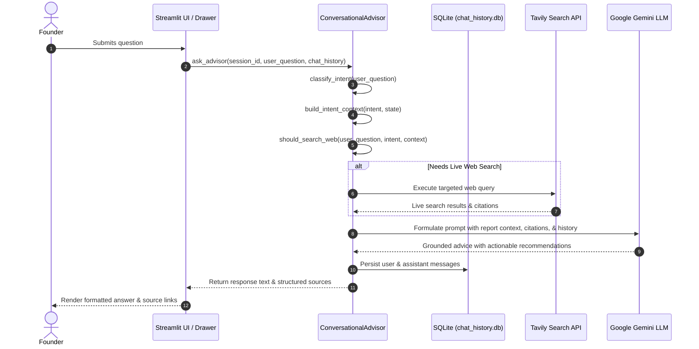

# AI Venture Advisor Specification

The **AI Venture Advisor** (`agents/conversational_advisor.py`) is an interactive conversational copilot embedded in the validation platform. It allows founders to interrogate their validation results, explore strategic pivots, and investigate competitors through natural language dialogue.

---

## 1. How the Advisor Works

The Advisor operates via a grounded query pipeline:

---

## 2. Intent Classification & Context Scoping

To optimize LLM prompt size and focus, the Advisor classifies incoming questions into distinct strategic categories:
- **`market`**: Queries regarding TAM, SAM, SOM, customer personas, or market trends. Context is scoped from `state.market_analysis`.
- **`competitor`**: Inquiries about incumbents, feature gaps, pricing, or moats. Context is scoped from `state.competitor_analysis`.
- **`risk` / `swot`**: Questions on vulnerabilities, threats, or regulatory compliance. Context is scoped from `state.swot_analysis`.
- **`mvp`**: Guidance on tech stacks, roadmap timing, or feature scope. Context is scoped from `state.mvp_recommendation`.
- **`general`**: Broad venture strategy, investor pitching, or questions spanning multiple sections.

---

## 3. Dynamic Live Web Research

When a founder inquires about information not present in the generated report (e.g., "What are the latest funding rounds for Competitor X?", "Are there new regulations in Europe for this sector?"), the Advisor triggers an autonomous live web search:
1. `should_search_web()` detects signals requiring current or external evidence.
2. The search query is formatted and executed via Tavily Search API.
3. Web sources are integrated into the response context and rendered with clickable domain citations.

---

## 4. Conversation Persistence & Storage

- **SQLite Database (`database/chat_history.db`)**: Stores conversation threads (`conversations` table) and individual chat exchanges (`messages` table) with strict `session_id` ownership isolation.
- **Session Memory Store (`state/memory.py`)**: Persists the serialised `StartupState` JSON linked to the active `session_id` under `.validation_memory/`.
- **Conversation Threading & Session Isolation**: Founders can create multiple independent chat threads per validation session, switch between past conversations, or delete obsolete threads with guaranteed cross-session boundary isolation.
