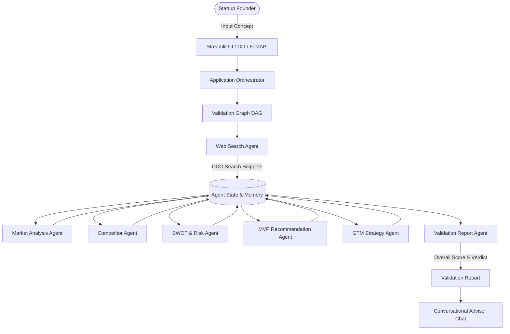

# System Architecture & Multi-Agent DAG Specification

The AI Startup Idea Validator platform is built on a modular multi-agent graph architecture designed to validate, score, and advise early-stage startup founders.

## Key Components

1. **State & Memory Layer (`state/`)**: Pydantic v2 schemas and JSON-backed persistence store.
2. **Specialized Agent Teams (`agents/`)**: Individual domain experts powered by Google Gemini LLMs with fallback heuristics.
3. **Tools & Scrapers (`tools/`)**: Real-time web search tool (DuckDuckGo), LLM JSON parsers, and report exporters.
4. **Pipeline Orchestrator (`pipeline/`)**: DAG controller (`ValidationGraph`) supporting step-by-step progress tracking.
5. **App & Delivery (`app/` & `ui/`)**: FastAPI REST API backend, CLI runner, and Streamlit web dashboard.
