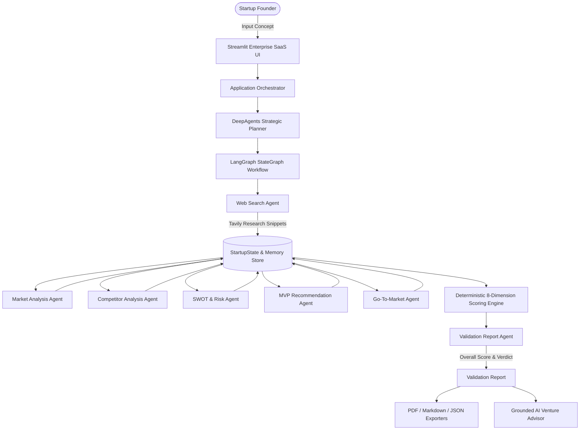

# System Architecture & Multi-Agent DAG Specification

The **Development of AI Based Startup Idea Validator with Market Analysis Assistance** platform is built on a modular multi-agent graph architecture designed to validate, score, and advise early-stage startup founders.

## Key Components

1. **State & Memory Layer (`state/`)**: Pydantic v2 schemas (`StartupState`) and JSON session persistence store (`MemoryStore`).
2. **Specialized Agent Teams (`agents/`)**: Specialized domain agents loaded via `PromptLoader` and powered by Google Gemini with Tavily web research.
3. **Services & Tools (`services/` & `tools/`)**: Real-time Tavily Search Service with deduplication and citation tracking, LLM Service, Dynamic Prompt Loader, and Report Exporters.
4. **Pipeline Orchestrator (`pipeline/`)**: LangGraph StateGraph workflow integrated with DeepAgents Strategic Planner.
5. **App & Interface (`app/` & `ui/`)**: Streamlit web dashboard with custom HTML/CSS design system and Plotly visualization charts.
