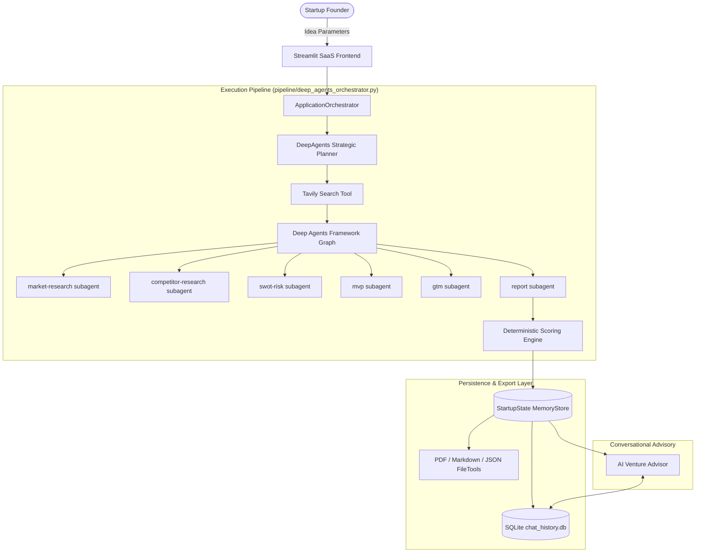

# System Architecture & Pipeline Specification

The **AI Startup Idea Validator** is an autonomous multi-agent validation and due diligence platform designed to evaluate early-stage venture hypotheses using live market intelligence and deterministic scoring.

---

## 1. High-Level System Architecture

The application is structured into five modular layers:

---

## 2. End-to-End Pipeline Flow

The validation pipeline executes sequentially across discrete stages:

1. **Startup Idea Input**: Founder provides Startup Name, Idea/Problem Description, Target Audience (ICP), Industry Sector, Business Model, Budget, and Launch Timeline.
2. **Hypothesis & Planning (`planner`)**: `DeepAgentsPlanner` decomposes the submission into structured research objectives and hypotheses.
3. **Live Web Research (`web_search`)**: `TavilySearchTool` issues targeted web queries retrieving real-time data across trends, competitors, customer pain points, and funding signals.
4. **Market Analysis (`market_analysis`)**: Sizes TAM, SAM, and SOM in billions, projects CAGR %, identifies sector growth drivers, and profiles ICP personas.
5. **Competitor Analysis (`competitor_analysis`)**: Identifies direct and indirect competitors, creates feature matrices, and evaluates defensibility moats.
6. **SWOT & Risk Assessment (`swot_risk`)**: Compiles a 4-quadrant SWOT matrix and quantifies risks into a probability &times; impact severity matrix with mitigation plans.
7. **MVP Scoping (`mvp_recommendation`)**: Formulates the core value proposition, prioritizes features (Must-Have vs. Should-Have), selects technology stacks, and scopes a 4-week roadmap.
8. **Go-To-Market Strategy (`gtm_strategy`)**: Details acquisition channels, pricing models, positioning statements, launch tactics, and estimated CAC.
9. **Report Synthesis (`report`)**: Integrates findings into an executive summary, strategic verdict, and next steps.
10. **Deterministic Scoring**: `DeterministicScoringEngine` calculates an objective 8-dimension weighted score (0–100 total) without AI randomness.
11. **Final Validation**: Complete state dossier is cached in memory, serialized to disk, rendered in the interactive UI, exported to PDF/MD/JSON, and attached to the AI Venture Advisor.

---

## 3. Data Flow & Contracts

All inter-agent communication is strictly governed by Pydantic V2 schemas located in `state/schema.py`:

- **Input Model**: `StartupIdea`
- **Intermediary Models**:
  - `DeepAgentsPlan` (Planning stage)
  - `WebSearchResults` (Tavily research stage)
  - `MarketAnalysis` (Market analysis stage)
  - `CompetitorAnalysis` (Competitor analysis stage)
  - `SWOTAnalysis` (SWOT & risk stage)
  - `MVPRecommendation` (MVP scoping stage)
  - `GTMStrategy` (Go-to-market stage)
  - `ScoringBreakdown` (Deterministic scoring stage)
- **Output Synthesis Model**: `ValidationReport` encapsulated within root `StartupState`.
